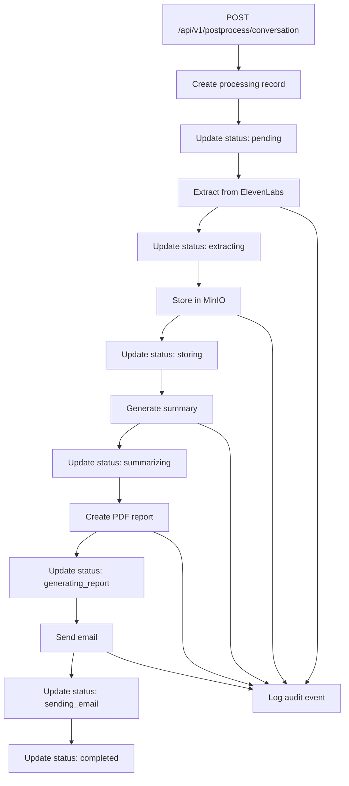
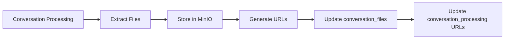

# Postprocess API Database Schema

## 🎯 **Overview**

This document defines the PostgreSQL database schema for the Postprocess API, including tables for tracking conversation processing, file storage, and audit logging.

## 📊 **Database Tables**

### **1. conversation_processing**

**Purpose**: Main table for tracking conversation processing jobs

```sql
CREATE TABLE conversation_processing (
    id SERIAL PRIMARY KEY,
    processing_id VARCHAR(255) UNIQUE NOT NULL,
    conversation_id VARCHAR(255) NOT NULL,
    email_id VARCHAR(255) NOT NULL,
    account_id VARCHAR(255) NOT NULL,
    
    -- Processing Status
    status VARCHAR(50) DEFAULT 'pending' NOT NULL,
    progress INTEGER DEFAULT 0 CHECK (progress >= 0 AND progress <= 100),
    current_step VARCHAR(100),
    error_message TEXT,
    
    -- Timing Information
    processing_started_at TIMESTAMP,
    processing_completed_at TIMESTAMP,
    estimated_completion TIMESTAMP,
    total_duration INTERVAL,
    
    -- File URLs
    minio_transcript_url TEXT,
    minio_audio_url TEXT,
    minio_report_url TEXT,
    
    -- AI Processing Results
    openai_summary TEXT,
    summary_topic VARCHAR(255),
    summary_sentiment VARCHAR(50),
    summary_key_points JSONB,
    summary_action_items JSONB,
    
    -- Metadata
    created_at TIMESTAMP DEFAULT NOW(),
    updated_at TIMESTAMP DEFAULT NOW(),
    
    -- Indexes
    CONSTRAINT fk_conversation_processing_account 
        FOREIGN KEY (account_id) REFERENCES accounts(id),
    CONSTRAINT valid_status 
        CHECK (status IN ('pending', 'extracting', 'storing', 'summarizing', 
                        'generating_report', 'sending_email', 'completed', 'failed', 'cancelled')),
    CONSTRAINT valid_sentiment 
        CHECK (summary_sentiment IN ('positive', 'negative', 'neutral', 'mixed'))
);

-- Indexes for performance
CREATE INDEX idx_conversation_processing_conversation_id ON conversation_processing(conversation_id);
CREATE INDEX idx_conversation_processing_account_id ON conversation_processing(account_id);
CREATE INDEX idx_conversation_processing_status ON conversation_processing(status);
CREATE INDEX idx_conversation_processing_created_at ON conversation_processing(created_at);
```

### **2. conversation_files**

**Purpose**: Track individual files associated with conversations

```sql
CREATE TABLE conversation_files (
    id SERIAL PRIMARY KEY,
    conversation_id VARCHAR(255) NOT NULL,
    account_id VARCHAR(255) NOT NULL,
    file_type VARCHAR(50) NOT NULL,
    file_name VARCHAR(255) NOT NULL,
    file_size BIGINT,
    minio_path TEXT NOT NULL,
    minio_url TEXT,
    url_expires_at TIMESTAMP,
    
    -- File metadata
    content_type VARCHAR(100),
    checksum VARCHAR(64),
    created_at TIMESTAMP DEFAULT NOW(),
    updated_at TIMESTAMP DEFAULT NOW(),
    
    -- Constraints
    CONSTRAINT fk_conversation_files_processing 
        FOREIGN KEY (conversation_id) REFERENCES conversation_processing(conversation_id),
    CONSTRAINT fk_conversation_files_account 
        FOREIGN KEY (account_id) REFERENCES accounts(id),
    CONSTRAINT valid_file_type 
        CHECK (file_type IN ('transcript', 'audio', 'report', 'summary')),
    CONSTRAINT valid_file_size 
        CHECK (file_size >= 0)
);

-- Indexes
CREATE INDEX idx_conversation_files_conversation_id ON conversation_files(conversation_id);
CREATE INDEX idx_conversation_files_account_id ON conversation_files(account_id);
CREATE INDEX idx_conversation_files_file_type ON conversation_files(file_type);
```

### **3. processing_audit_log**

**Purpose**: Track all processing events and operations

```sql
CREATE TABLE processing_audit_log (
    id SERIAL PRIMARY KEY,
    processing_id VARCHAR(255) NOT NULL,
    conversation_id VARCHAR(255) NOT NULL,
    account_id VARCHAR(255) NOT NULL,
    
    -- Event details
    event_type VARCHAR(100) NOT NULL,
    event_status VARCHAR(50) NOT NULL,
    step_name VARCHAR(100),
    step_duration INTERVAL,
    
    -- Event data
    event_data JSONB,
    error_message TEXT,
    retry_count INTEGER DEFAULT 0,
    
    -- Timing
    created_at TIMESTAMP DEFAULT NOW(),
    
    -- Constraints
    CONSTRAINT fk_processing_audit_log_processing 
        FOREIGN KEY (processing_id) REFERENCES conversation_processing(processing_id),
    CONSTRAINT valid_event_status 
        CHECK (event_status IN ('started', 'completed', 'failed', 'retried')),
    CONSTRAINT valid_retry_count 
        CHECK (retry_count >= 0)
);

-- Indexes
CREATE INDEX idx_processing_audit_log_processing_id ON processing_audit_log(processing_id);
CREATE INDEX idx_processing_audit_log_conversation_id ON processing_audit_log(conversation_id);
CREATE INDEX idx_processing_audit_log_event_type ON processing_audit_log(event_type);
CREATE INDEX idx_processing_audit_log_created_at ON processing_audit_log(created_at);
```

### **4. account_settings**

**Purpose**: Store account-specific configuration for postprocess operations

```sql
CREATE TABLE account_settings (
    id SERIAL PRIMARY KEY,
    account_id VARCHAR(255) UNIQUE NOT NULL,
    
    -- Email settings
    default_email_template TEXT,
    email_subject_template VARCHAR(255),
    email_from_name VARCHAR(255),
    email_from_address VARCHAR(255),
    
    -- Processing settings
    max_file_size_mb INTEGER DEFAULT 10,
    processing_timeout_minutes INTEGER DEFAULT 10,
    enable_audio_storage BOOLEAN DEFAULT true,
    enable_transcript_storage BOOLEAN DEFAULT true,
    enable_report_generation BOOLEAN DEFAULT true,
    
    -- OpenAI settings
    openai_model VARCHAR(100) DEFAULT 'gpt-4',
    openai_max_tokens INTEGER DEFAULT 1000,
    custom_system_prompt TEXT,
    
    -- MinIO settings
    minio_bucket_name VARCHAR(255),
    file_retention_days INTEGER DEFAULT 30,
    
    -- Metadata
    created_at TIMESTAMP DEFAULT NOW(),
    updated_at TIMESTAMP DEFAULT NOW(),
    
    -- Constraints
    CONSTRAINT fk_account_settings_account 
        FOREIGN KEY (account_id) REFERENCES accounts(id),
    CONSTRAINT valid_file_size 
        CHECK (max_file_size_mb > 0 AND max_file_size_mb <= 100),
    CONSTRAINT valid_timeout 
        CHECK (processing_timeout_minutes > 0 AND processing_timeout_minutes <= 60),
    CONSTRAINT valid_retention 
        CHECK (file_retention_days > 0 AND file_retention_days <= 365)
);
```

### **5. api_usage_metrics**

**Purpose**: Track API usage and rate limiting

```sql
CREATE TABLE api_usage_metrics (
    id SERIAL PRIMARY KEY,
    account_id VARCHAR(255) NOT NULL,
    api_key_hash VARCHAR(255) NOT NULL,
    
    -- Usage tracking
    endpoint VARCHAR(100) NOT NULL,
    request_count INTEGER DEFAULT 1,
    success_count INTEGER DEFAULT 0,
    error_count INTEGER DEFAULT 0,
    
    -- Rate limiting
    rate_limit_exceeded BOOLEAN DEFAULT false,
    rate_limit_reset_at TIMESTAMP,
    
    -- Timing
    window_start TIMESTAMP NOT NULL,
    window_end TIMESTAMP NOT NULL,
    created_at TIMESTAMP DEFAULT NOW(),
    
    -- Constraints
    CONSTRAINT fk_api_usage_metrics_account 
        FOREIGN KEY (account_id) REFERENCES accounts(id),
    CONSTRAINT valid_counts 
        CHECK (request_count >= 0 AND success_count >= 0 AND error_count >= 0)
);

-- Indexes
CREATE INDEX idx_api_usage_metrics_account_id ON api_usage_metrics(account_id);
CREATE INDEX idx_api_usage_metrics_api_key_hash ON api_usage_metrics(api_key_hash);
CREATE INDEX idx_api_usage_metrics_window ON api_usage_metrics(window_start, window_end);
```

## 🔄 **Data Flow**

### **Processing Job Lifecycle**



### **File Storage Tracking**



## 📝 **SQLAlchemy Models**

### **ConversationProcessing Model**

```python
from sqlalchemy import Column, Integer, String, Text, DateTime, Interval, JSON, CheckConstraint
from sqlalchemy.ext.declarative import declarative_base
from sqlalchemy.sql import func

Base = declarative_base()

class ConversationProcessing(Base):
    __tablename__ = 'conversation_processing'
    
    id = Column(Integer, primary_key=True)
    processing_id = Column(String(255), unique=True, nullable=False)
    conversation_id = Column(String(255), nullable=False)
    email_id = Column(String(255), nullable=False)
    account_id = Column(String(255), nullable=False)
    
    # Processing Status
    status = Column(String(50), default='pending', nullable=False)
    progress = Column(Integer, default=0)
    current_step = Column(String(100))
    error_message = Column(Text)
    
    # Timing Information
    processing_started_at = Column(DateTime)
    processing_completed_at = Column(DateTime)
    estimated_completion = Column(DateTime)
    total_duration = Column(Interval)
    
    # File URLs
    minio_transcript_url = Column(Text)
    minio_audio_url = Column(Text)
    minio_report_url = Column(Text)
    
    # AI Processing Results
    openai_summary = Column(Text)
    summary_topic = Column(String(255))
    summary_sentiment = Column(String(50))
    summary_key_points = Column(JSON)
    summary_action_items = Column(JSON)
    
    # Metadata
    created_at = Column(DateTime, default=func.now())
    updated_at = Column(DateTime, default=func.now(), onupdate=func.now())
    
    __table_args__ = (
        CheckConstraint("status IN ('pending', 'extracting', 'storing', 'summarizing', 'generating_report', 'sending_email', 'completed', 'failed', 'cancelled')"),
        CheckConstraint("progress >= 0 AND progress <= 100"),
        CheckConstraint("summary_sentiment IN ('positive', 'negative', 'neutral', 'mixed')"),
    )
```

### **ConversationFiles Model**

```python
class ConversationFiles(Base):
    __tablename__ = 'conversation_files'
    
    id = Column(Integer, primary_key=True)
    conversation_id = Column(String(255), nullable=False)
    account_id = Column(String(255), nullable=False)
    file_type = Column(String(50), nullable=False)
    file_name = Column(String(255), nullable=False)
    file_size = Column(Integer)
    minio_path = Column(Text, nullable=False)
    minio_url = Column(Text)
    url_expires_at = Column(DateTime)
    
    # File metadata
    content_type = Column(String(100))
    checksum = Column(String(64))
    created_at = Column(DateTime, default=func.now())
    updated_at = Column(DateTime, default=func.now(), onupdate=func.now())
    
    __table_args__ = (
        CheckConstraint("file_type IN ('transcript', 'audio', 'report', 'summary')"),
        CheckConstraint("file_size >= 0"),
    )
```

## 🔧 **Database Operations**

### **Creating Processing Job**

```python
async def create_processing_job(
    conversation_id: str,
    email_id: str,
    account_id: str
) -> ConversationProcessing:
    """Create a new processing job record"""
    
    processing_id = f"proc_{int(time.time())}_{random.randint(1000, 9999)}"
    
    job = ConversationProcessing(
        processing_id=processing_id,
        conversation_id=conversation_id,
        email_id=email_id,
        account_id=account_id,
        status='pending',
        progress=0
    )
    
    db.add(job)
    await db.commit()
    await db.refresh(job)
    
    return job
```

### **Updating Processing Status**

```python
async def update_processing_status(
    processing_id: str,
    status: str,
    progress: int = None,
    current_step: str = None,
    error_message: str = None
) -> ConversationProcessing:
    """Update the status of a processing job"""
    
    job = await db.query(ConversationProcessing).filter(
        ConversationProcessing.processing_id == processing_id
    ).first()
    
    if not job:
        raise ValueError(f"Processing job {processing_id} not found")
    
    job.status = status
    if progress is not None:
        job.progress = progress
    if current_step is not None:
        job.current_step = current_step
    if error_message is not None:
        job.error_message = error_message
    
    job.updated_at = func.now()
    
    await db.commit()
    await db.refresh(job)
    
    return job
```

### **Storing File Information**

```python
async def store_file_info(
    conversation_id: str,
    account_id: str,
    file_type: str,
    file_name: str,
    minio_path: str,
    file_size: int = None,
    content_type: str = None
) -> ConversationFiles:
    """Store file information in the database"""
    
    file_record = ConversationFiles(
        conversation_id=conversation_id,
        account_id=account_id,
        file_type=file_type,
        file_name=file_name,
        minio_path=minio_path,
        file_size=file_size,
        content_type=content_type
    )
    
    db.add(file_record)
    await db.commit()
    await db.refresh(file_record)
    
    return file_record
```

### **Updating File URLs**

```python
async def update_file_urls(
    conversation_id: str,
    transcript_url: str = None,
    audio_url: str = None,
    report_url: str = None
) -> ConversationProcessing:
    """Update file URLs for a conversation"""
    
    job = await db.query(ConversationProcessing).filter(
        ConversationProcessing.conversation_id == conversation_id
    ).first()
    
    if not job:
        raise ValueError(f"Conversation {conversation_id} not found")
    
    if transcript_url:
        job.minio_transcript_url = transcript_url
    if audio_url:
        job.minio_audio_url = audio_url
    if report_url:
        job.minio_report_url = report_url
    
    job.updated_at = func.now()
    
    await db.commit()
    await db.refresh(job)
    
    return job
```

## 📊 **Database Migrations**

### **Initial Migration**

```sql
-- Migration: 001_create_postprocess_tables.sql

-- Create conversation_processing table
CREATE TABLE conversation_processing (
    id SERIAL PRIMARY KEY,
    processing_id VARCHAR(255) UNIQUE NOT NULL,
    conversation_id VARCHAR(255) NOT NULL,
    email_id VARCHAR(255) NOT NULL,
    account_id VARCHAR(255) NOT NULL,
    status VARCHAR(50) DEFAULT 'pending' NOT NULL,
    progress INTEGER DEFAULT 0 CHECK (progress >= 0 AND progress <= 100),
    current_step VARCHAR(100),
    error_message TEXT,
    processing_started_at TIMESTAMP,
    processing_completed_at TIMESTAMP,
    estimated_completion TIMESTAMP,
    total_duration INTERVAL,
    minio_transcript_url TEXT,
    minio_audio_url TEXT,
    minio_report_url TEXT,
    openai_summary TEXT,
    summary_topic VARCHAR(255),
    summary_sentiment VARCHAR(50),
    summary_key_points JSONB,
    summary_action_items JSONB,
    created_at TIMESTAMP DEFAULT NOW(),
    updated_at TIMESTAMP DEFAULT NOW(),
    CONSTRAINT valid_status CHECK (status IN ('pending', 'extracting', 'storing', 'summarizing', 'generating_report', 'sending_email', 'completed', 'failed', 'cancelled')),
    CONSTRAINT valid_sentiment CHECK (summary_sentiment IN ('positive', 'negative', 'neutral', 'mixed'))
);

-- Create indexes
CREATE INDEX idx_conversation_processing_conversation_id ON conversation_processing(conversation_id);
CREATE INDEX idx_conversation_processing_account_id ON conversation_processing(account_id);
CREATE INDEX idx_conversation_processing_status ON conversation_processing(status);
CREATE INDEX idx_conversation_processing_created_at ON conversation_processing(created_at);

-- Create conversation_files table
CREATE TABLE conversation_files (
    id SERIAL PRIMARY KEY,
    conversation_id VARCHAR(255) NOT NULL,
    account_id VARCHAR(255) NOT NULL,
    file_type VARCHAR(50) NOT NULL,
    file_name VARCHAR(255) NOT NULL,
    file_size BIGINT,
    minio_path TEXT NOT NULL,
    minio_url TEXT,
    url_expires_at TIMESTAMP,
    content_type VARCHAR(100),
    checksum VARCHAR(64),
    created_at TIMESTAMP DEFAULT NOW(),
    updated_at TIMESTAMP DEFAULT NOW(),
    CONSTRAINT valid_file_type CHECK (file_type IN ('transcript', 'audio', 'report', 'summary')),
    CONSTRAINT valid_file_size CHECK (file_size >= 0)
);

-- Create indexes
CREATE INDEX idx_conversation_files_conversation_id ON conversation_files(conversation_id);
CREATE INDEX idx_conversation_files_account_id ON conversation_files(account_id);
CREATE INDEX idx_conversation_files_file_type ON conversation_files(file_type);
```

## 🔍 **Query Examples**

### **Get Processing Status**

```sql
SELECT 
    processing_id,
    conversation_id,
    status,
    progress,
    current_step,
    processing_started_at,
    processing_completed_at,
    total_duration,
    minio_transcript_url,
    minio_audio_url,
    minio_report_url,
    summary_topic,
    summary_sentiment
FROM conversation_processing 
WHERE processing_id = 'proc_123456789';
```

### **Get Account Processing History**

```sql
SELECT 
    cp.conversation_id,
    cp.status,
    cp.progress,
    cp.created_at,
    cp.processing_completed_at,
    cp.summary_topic,
    cf.file_type,
    cf.file_name,
    cf.minio_url
FROM conversation_processing cp
LEFT JOIN conversation_files cf ON cp.conversation_id = cf.conversation_id
WHERE cp.account_id = 'acc123'
ORDER BY cp.created_at DESC
LIMIT 50;
```

### **Get Failed Jobs**

```sql
SELECT 
    processing_id,
    conversation_id,
    error_message,
    created_at,
    processing_started_at
FROM conversation_processing 
WHERE status = 'failed'
AND created_at >= NOW() - INTERVAL '24 hours'
ORDER BY created_at DESC;
```

### **Get Processing Statistics**

```sql
SELECT 
    status,
    COUNT(*) as job_count,
    AVG(EXTRACT(EPOCH FROM (processing_completed_at - processing_started_at))) as avg_duration_seconds,
    MIN(created_at) as earliest_job,
    MAX(created_at) as latest_job
FROM conversation_processing 
WHERE created_at >= NOW() - INTERVAL '7 days'
GROUP BY status
ORDER BY job_count DESC;
```

## 🔒 **Data Retention**

### **Retention Policies**

```sql
-- Delete old audit logs (keep 90 days)
DELETE FROM processing_audit_log 
WHERE created_at < NOW() - INTERVAL '90 days';

-- Delete old file records (keep 30 days)
DELETE FROM conversation_files 
WHERE created_at < NOW() - INTERVAL '30 days';

-- Archive completed jobs older than 1 year
UPDATE conversation_processing 
SET status = 'archived' 
WHERE status = 'completed' 
AND created_at < NOW() - INTERVAL '1 year';
```

This comprehensive database schema provides complete tracking of conversation processing, file storage, and audit logging for the postprocess API feature.
